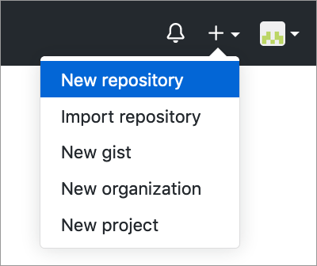
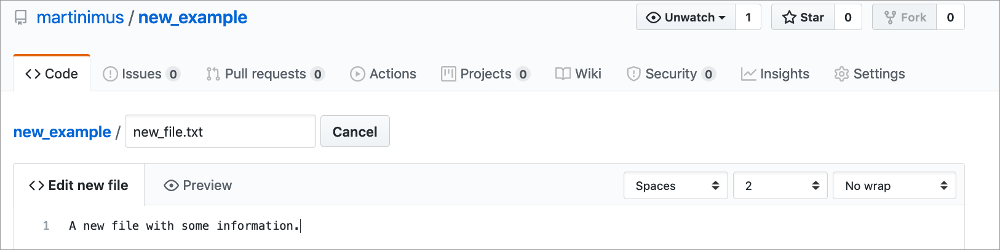
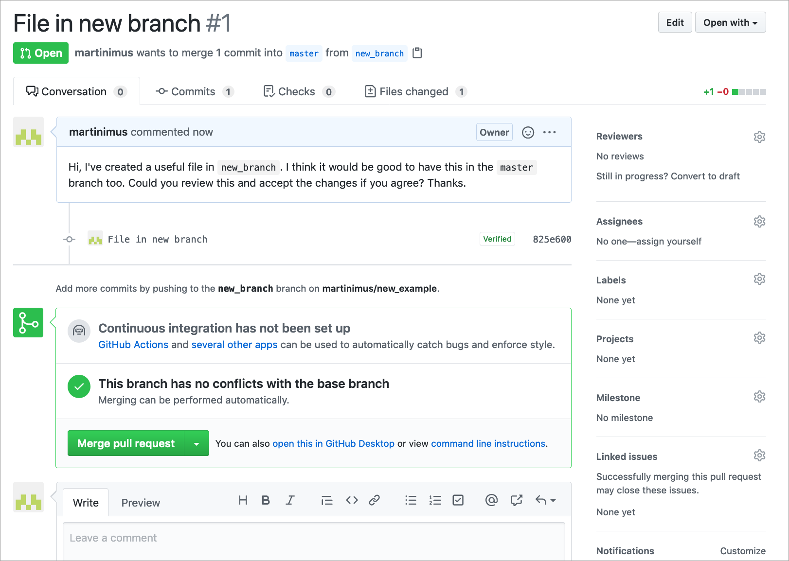
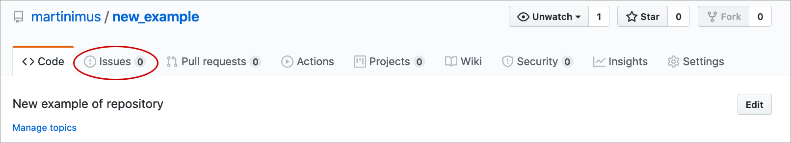
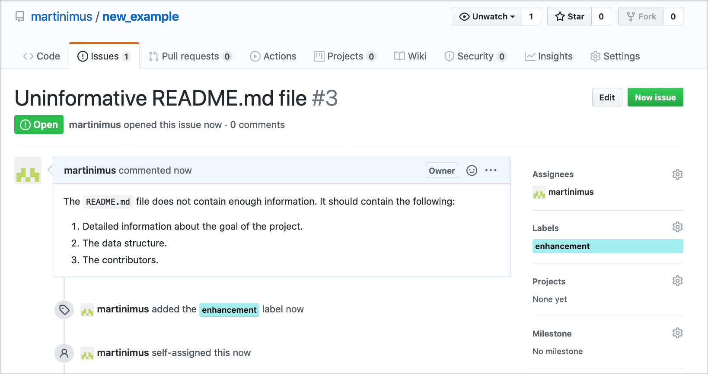
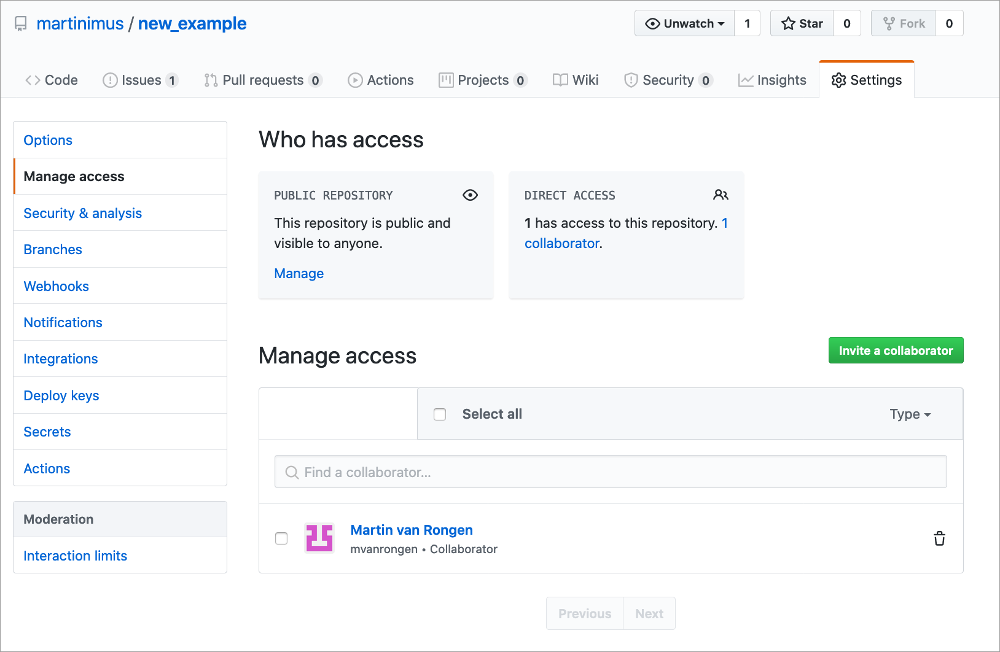

# GitHub

## Objectives
:::objectives
* Be able to create and delete repositories on GitHub
* Be able to create Issues
* Know how to fork an existing repository
* Manage access
:::

## Starting on GitHub

### Creating a new repository

Start a new repository by navigation to the top right corner on GitHub:

This brings up a screen with the following options:

1. Name of repository you want to create
2. A short description of what the repository contains
3. Make the repository Public or Private
4. Check the `Initialize this repository with a README` to create a README file (recommended)
5. Add a license (any license is better than none, but do look into what restrictions they impose)
6. Create the repository

### Deleting a repository
It happens. Sometimes you might just want to delete a repository, for whatever reason. Nothing to be ashamed of. But useful to know how!

You go to your repository > `Settings` then scroll all the way down to the bottom. There you'll find something called the **Danger Zone**. When you press the `Delete this repository` button, it'll ask you to type in the name of the repository, to make absolutely sure that you know that you're about to delete it. There's no going back after that, so if you're not sure you'll need the code later on - leave it.

## Exercise: New repository
:::exercise
For this exercise we'll practice creating a repository.

1. Create a new repository on your GitHub account
2. Edit the README file and commit changes

Remember the following:
 
* Use a meaningful name for your repository
* Initialise the repository with a README file
* Add an extension to the file name when creating a new file

:::

## Creating a new file (optional)
We can add files directly from the GitHub interface. We'll do this just to practice, but you'll be unlikely to use this very often - I generally link a repository to an RStudio project and work that way.

To create a new file, click on the `Create new file` button:

You then have the possibility to create a new file, in this case we are calling it `new_file.txt`. Note the use of file extensions. A file extension is required!

To add the file you need to add a **commit message**. A commit message should be a brief description of what you've done. You can add more information on _how_ you have done things in the commit description.

Here we are adding it directly to the `master` branch. We will learn how to create branches next.

## Creating a new branch (optional) {#create-branch}

You usually create a new branch if you want to add or change something in the `master` branch, but you're not entirely sure if it will work or affect others working on the same files. Creating a branch makes a copy of your repository that you can freely edit, without having to worry about these things. We will call this a `feature` branch.

To create a feature branch, click on the `Branch: master` button on the main repository page. This will display a list of branches (if there are any). To add a new branch simply type in the name you want and press `Enter`.

This `new_branch` will be the same as the `master` branch (because it is an exact copy). To generate some changes, we add a new file called `file_in_new_branch.txt`. Once committed, we are taken back to the main repository page (note that you are now in `Branch: new_branch` if you have created a branch called `new_branch`). Because you have made a copy of your repository and you have made some changes, GitHub now gives you the opportunity to compare your `new_branch` with the `master` branch.

Comparing the branches enables you to generate a **pull request**, which enables you to let people know that you have made changes. This means that people can review the changes and implement them. We will do that next.

## Pull requests (optional) {#pull-requests}

To start a pull request, press the `Compare & pull request` button. This takes you to a screen where you can add a message to whoever is maintaining the `master` branch, explaining what you have done in your `new_branch` and requesting to implement the changes.

After you press the `Create pull request` button you have the opportunity to merge the two branches. At the bottom of the screen you can write a message to the person who generated the pull request.

After you have merged the branches your feature branch becomes obsolete, so you can decide to delete it. Unless you want to make more changes, but it would be best to start a new branch for that again.

You are taken back to the main repository page once the pull request is merged with the `master` branch. You can see the changes have been implemented, because you now have a `file_in_new_branch.txt` in your `master` branch.

## Exercise: Pull requests (optional)
:::exercise
Pull requests are helpful if you've been contributing to a repository and you want the maintainer of the repository to consider adding the changes you've made to the `main`, live branch.

1. Open a pull request
2. Review the changes
3. Make more changes and push them
4. Review the new changes and commit them
5. Merge the branch with the `master` branch

:::

## Forking projects

So far we have used repositories that we created ourselves. But you might find that you want to add or make changes to a repository that somebody else owns. Or you like their project and want to adapt it to your needs. In that case you need to make a personal copy of that project. This is called **forking**.

To fork a repository you need to navigate to the repository page on the maintainers GitHub account whilst logged into your own account. You then click on the `fork` button. The repository is then copied to your account:

The forked repository will show up in your repository list. It will specify that it is a forked repository:

Once you have forked a repository to your GitHub account you can make changes to it. Good practice is to create a **new branch** in your copy of the repository, so that you do not run the risk of confusing the `master` branch of your copy with the `master` branch of the original repository.

In this case we're adding a new branch called `new_feature`.

After you have created a new branch on your forked copy you can start editing/adding as you like. You do this as you have done before, by **staging** and **committing** changes to your repository.

When you want to suggest incorporating some of these changes into the original repository you will have to open a **pull request**. This works in the same way is described in the [pull requests](#pull-requests) section, but instead of comparing two branches on the same repository, you are comparing the branch on your forked copy with the `master` branch of the original repository.

Your pull request will show up in the original repository. Note that you can also see that the original repository has been forked:

## Creating issues

GitHub keeps track of bugs, improvements and tasks through **Issues**. The good thing about issues is that they can be shared and discussed with collaborators, in a similar way as to how the pull request system works.

An issue is created from the `Issues` tab in the repository:

A new issue requires a title and description. It's good to try and be as concise and complete as possible so that the developer knows what it is that you want. You can label the issue - in this case it is an Enhancement, but there is a whole range of labels you can choose from. Labelling can be particularly helpful when there are many issues and it helps you organise and prioritise your work.

Issues are always assigned a unique ID, which you can use to refer to them in comments:

## Managing access

When you have a public repository everyone can fork the repository and make changes to that (forked) copy. You can also invite people to collaborate on your project.

In order to do that you need to go to the `Settings` > `Manage access` page:

Here you can invite collaborators and once they have accepted, then can open pull requests and make changes to the repository.

To find repositories where you are a collaborator on you need to go to `Settings` > `Repositories`. Unfortunately these repositories do not show up on your own Repositories tab.

## Key points

:::keypoints
* Repositories can be created and deleted on GitHub
* Branches are helpful when you're working on a new feature/addition without affecting the live `main` branch
* Forking allows you to work on somebody else's repository
* Issues are a useful tool to keep track of bugs, enhancements, ideas etc
:::
