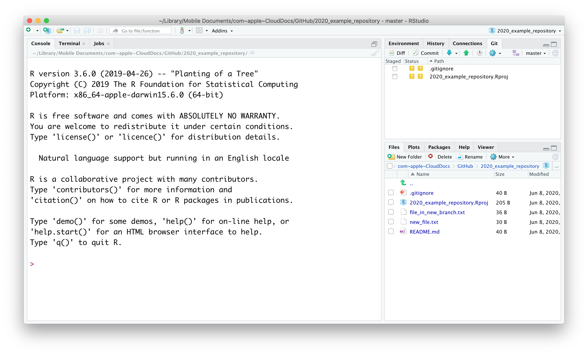
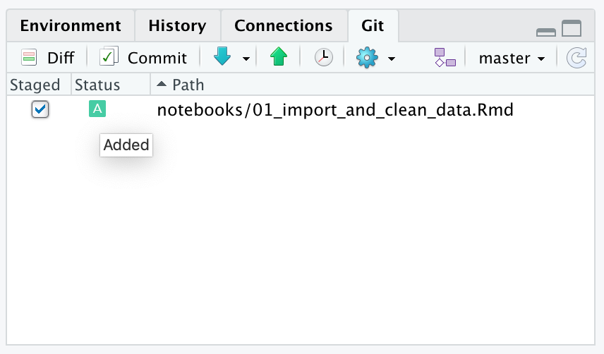
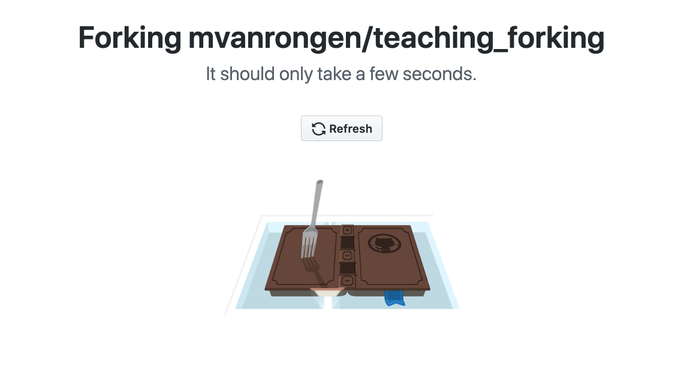
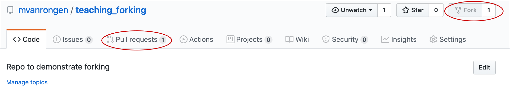
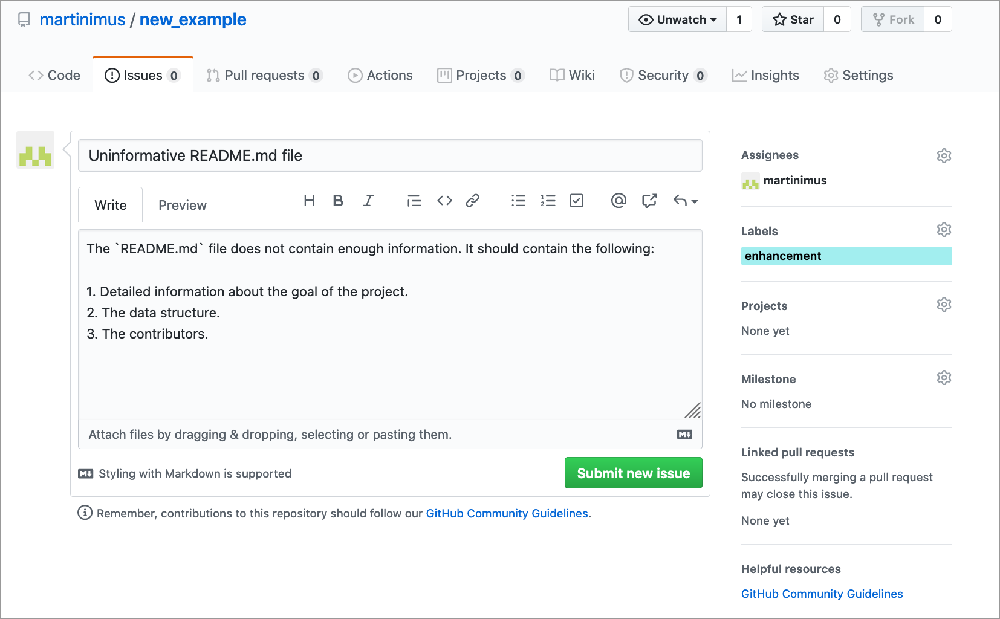
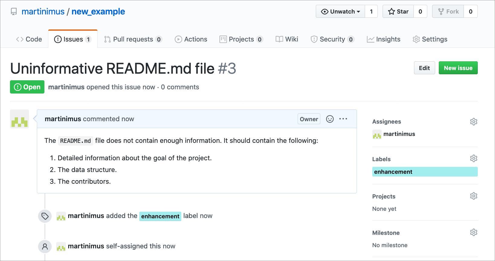
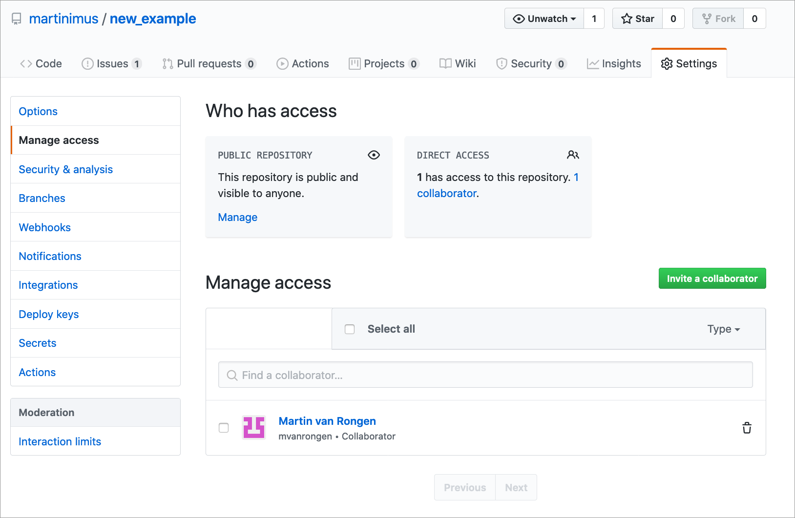

# GitHub and RStudio

## Objectives
:::objectives

* Link an RStudio project with GitHub
* Create and edit files in RStudio
* Commit and push changes to GitHub
:::

## Installation instructions

Please ensure that you have done the following before the course (needed for version control exercises):

1. Install R Studio, create a GitHub account and a GitHub Personal Access Token (copy latter as this is the only time it is displayed!) creation.
    a. Create a GitHub account on: [https://github.com](https://github.com)
    b. Make sure to have R Studio installed. You can download it [here](https://www.rstudio.com/products/rstudio/download/)
    c. Set up a personal token to allow R Studio to link to GitHub (this is in place of using a password): 
[https://docs.github.com/en/authentication/keeping-your-account-and-data-secure/creating-a-personal-access-token](https://docs.github.com/en/authentication/keeping-your-account-and-data-secure/creating-a-personal-access-token)

2. Install command line git software which will be used by R Studio:
    a. Installing command line git
[https://support.rstudio.com/hc/en-us/articles/200532077-Version-Control-with-Git-and-SVN](https://support.rstudio.com/hc/en-us/articles/200532077-Version-Control-with-Git-and-SVN)
    b. Later we will set up R Studio to access git and then it might be useful to know where git has been installed. This can be found out by either using the command `git --exec-path` from a command line prompt (Windows/Linux/Mac) or from the Terminal pane within R Studio.

On a Mac/Linux computer you can also issue a `which git` command at the command line or R Studio Terminal. Results may differ between these commands as operating systems often use aliases that point to the real location of the program.

## Using GitHub from RStudio

Although you can do more or less all the version control aspects via the GitHub website, this is not very convenient when you are working on your R projects. Now you have an idea of how the GitHub workflow works, we can start to integrate these version control concepts with RStudio.

### Linking Git and RStudio

To use Git from within RStudio you need to make sure that Git can be found by RStudio.

If you haven't done so already, make sure to go to: `Tools` > `Global Options` > `Git/SVN` and check that 'Enable version control interface for RStudio projects` is enabled. Also, check that the path to Git is present and correct.

### Starting a new project under Git control

If you want version control of your R project, you need to make sure that the project is under control of Git.

The easiest way to start this is by creating a **new project** that is **linked to an existing GitHub repository**.

We can link a new project to the GitHub repository that we generated previously. To do this, we need to copy the URL for this repository. To do this, you have to go to the repository page and click on the `Clone or download` button. You can then copy the URL as shown below:

Next, we need to create a new project. Go to `File` > `New Project` > `Version Control` > `Git`.

In `Repository URL` paste the link to your GitHub repository.
Give the project a name (avoid spaces and try to use a meaningful name) and tell RStudio where to save it.

:::note
It is useful to tick the `Open in a new session` box, so that your project opens in a new RStudio session. That way RStudio opens a session with a clean environment.
:::

Your project will open and your RStudio session should now have an extra tab in the top right corner (where your Environment is), named `Git`. This is where all the changes will show up as you work on your project.

These options can also be found by using the

button in the toolbar. When you have opened a file and look at the options under this button it also enables you to find differences from the last commit (if there are any) or view the commit history of that file.

### Changes and your remote repository

Let's make some changes to our local repository, which is now under Git control. Here we are first creating a folder called `notebooks` and adding an R Markdown file named `01_import_and_clean_data.Rmd`.

Once you have created the file you'll see the folder appearing in the `Git` tab. When you tick the `Staged` box, the  `Status` changes to Added. This means that Git is tracking your file and will include it in the next commit.

There are a few other icons that can appear in the Git pane, so here is an overview:

*

, **untracked** file. Git has not seen this before and it needs to be added before changes are tracked.
*

, **added** file. The file is now tracked by Git.
*

, **modified** file. The file has been modified since the last commit.
*

, **deleted** file. The file has been deleted since the last commit.

When we edit the file a bit we can see how it changed by clicking on the `Diff` button in the `Git` toolbar.

If we are happy with the changes then we can commit them. You can do this by pressing the `Commit` button in the `Git` tab and adding a commit message. All the files that are staged will be included in that particular commit. If there are files that you do not want to commit yet then you can untick them before pressing the `Commit` button.

To ensure that the changes end up on your remote repository you need to **push** the changes. To do this, press the `Push` button in the top right corner. RStudio will give you a message that the changes are pushed:

## Exercise: Version control in RStudio
::: exercise
To get us going, we need to have a repository to play with. You can either use the repository you've created previously, or create a new one:

1. Create a new repository on GitHub
2. Create a new R Project under version control
3. Link the R Project with the remote repository

:::

## Exercise: Branching and changes

::: exercise
Now we've got a project under version control we can practice what we'll do if we want to create a new feature to our existing repository, but do not want to send that to the `main` branch (yet). To do this, we use the following steps:

1. Create a new branch (e.g. `new_notebook` or anything that describes the feature you're adding) from within RStudio. To do this, use the following button in the `Git` pane:

2. Create a `notebooks` folder and save a new R Markdown file in it.
3. Ensure that changes to the new file are tracked.
4. Make some changes to the file and commit them.
5. Push the changes to the remote repository.
:::

## Exercise (optional): Creating a pull request 
::: exercise
This is something we have done previously, but might be helpful to practice again. In this case you're kind of talking to yourself: you've created a repository, added a new branch to introduce a feature and now you are ready to publish that feature to the main repository.

What this does is make update the main repository with the changes you've made in the branch. This bit is again most easily done via the GitHub webpage. So, navigate to your GitHub account and find the repository you're working on...

We start that process by creating a **pull request**. Here you're basically asking yourself to add the feature you've created. How polite! We complete the following steps:

1. Go to your GitHub repository and navigate to the newly created branch
2. Create a pull request
3. Merge the pull request with the `master` branch
4. Congratulate yourself on being a version control Pro!

:::

## Forking projects

So far we have used repositories that we created ourselves. But you might find that you want to add or make changes to a repository that somebody else owns. Or you like their project and want to adapt it to your needs. In that case you need to make a personal copy of that project. This is called **forking**.

To fork a repository you need to navigate to the repository page on the maintainers GitHub account whilst logged into your own account. You then click on the `fork` button. The repository is then copied to your account:

The forked repository will show up in your repository list. It will specify that it is a forked repository:

Once you have forked a repository to your GitHub account you can make changes to it. Good practice is to create a **new branch** in your copy of the repository, so that you do not run the risk of confusing the `master` branch of your copy with the `master` branch of the original repository.

In this case we're adding a new branch called `new_feature`.

After you have created a new branch on your forked copy you can start editing/adding as you like. You do this as you have done before, by **staging** and **committing** changes to your repository.

When you want to suggest incorporating some of these changes into the original repository you will have to open a **pull request**. This works in the same way is described in the [pull requests](#pull-requests) section, but instead of comparing two branches on the same repository, you are comparing the branch on your forked copy with the `master` branch of the original repository.

Your pull request will show up in the original repository. Note that you can also see that the original repository has been forked:

## Creating issues

GitHub keeps track of bugs, improvements and tasks through **Issues**. The good thing about issues is that they can be shared and discussed with collaborators, in a similar way as to how the pull request system works.

An issue is created from the `Issues` tab in the repository:

A new issue requires a title and description. It's good to try and be as concise and complete as possible so that the developer knows what it is that you want. You can label the issue - in this case it is an Enhancement, but there is a whole range of labels you can choose from. Labelling can be particularly helpful when there are many issues and it helps you organise and prioritise your work.

Issues are always assigned a unique ID, which you can use to refer to them in comments:

## Managing access

When you have a public repository everyone can fork the repository and make changes to that (forked) copy. You can also invite people to collaborate on your project.

In order to do that you need to go to the `Settings` > `Manage access` page:

Here you can invite collaborators and once they have accepted, then can open pull requests and make changes to the repository.

To find repositories where you are a collaborator on you need to go to `Settings` > `Repositories`. Unfortunately these repositories do not show up on your own Repositories tab.

## Key points

:::keypoints
* You can link repositories to RStudio by cloning them
* Once cloned and under version control, you can commit and push changes to the remote repository
* You can create new branches from within RStudio
* Issues can be raised on GitHub to keep track of bugs, improvements and tasks
:::
