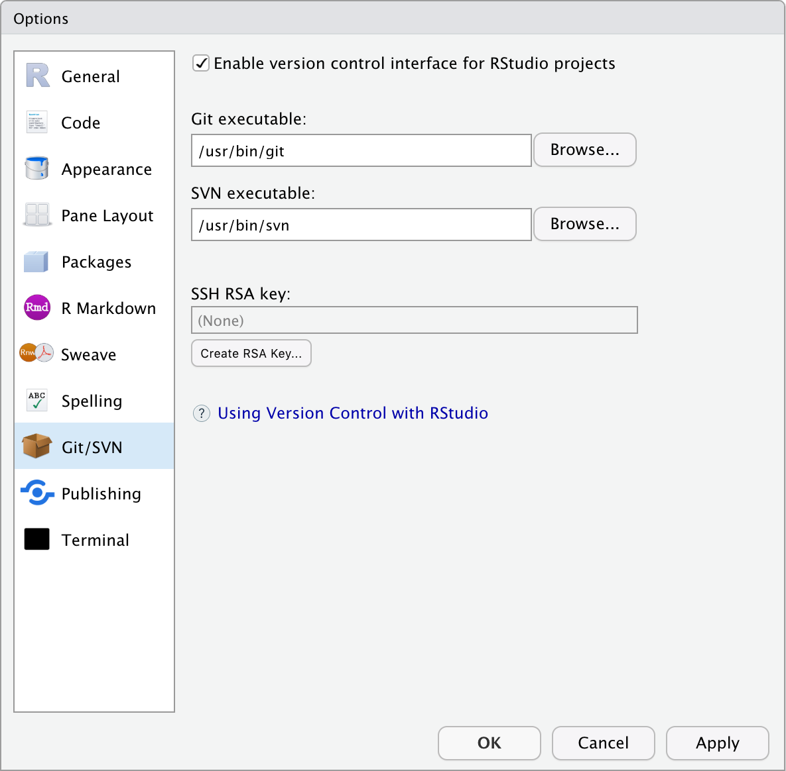
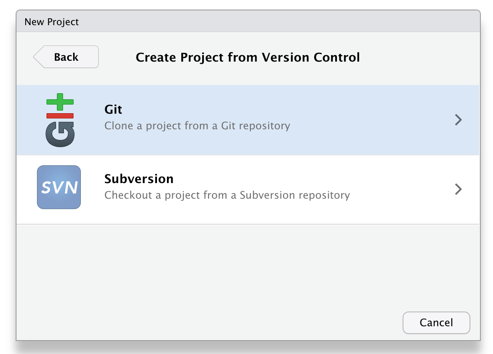
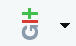
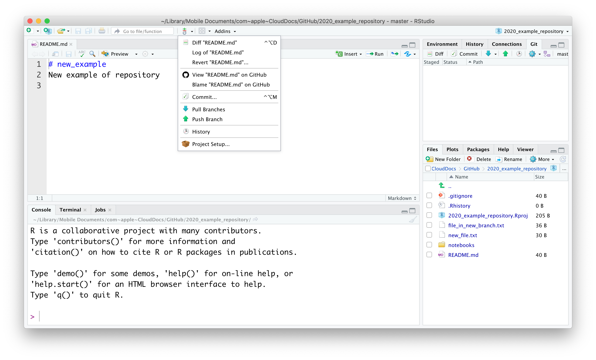
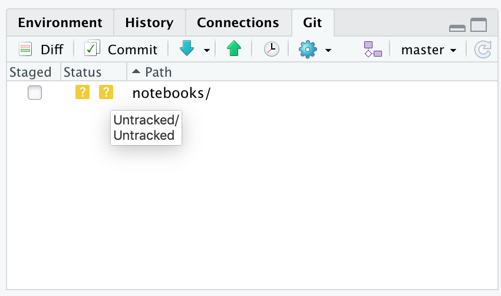

# GitHub and RStudio

## Objectives
:::objectives

* Link an RStudio project with GitHub
* Create and edit files in RStudio
* Commit and push changes to GitHub
:::

## Using GitHub from RStudio

Although you can do more or less all the version control aspects via the GitHub website, this is not very convenient when you are working on your R projects. Now you have an idea of how the GitHub workflow works, we can start to integrate these version control concepts with RStudio.

### Linking Git and RStudio

To use Git from within RStudio you need to make sure that Git can be found by RStudio.

If you haven't done so already, make sure to go to: `Tools` > `Global Options` > `Git/SVN` and check that 'Enable version control interface for RStudio projects` is enabled. Also, check that the path to Git is present and correct.

### Starting a new project under Git control

If you want version control of your R project, you need to make sure that the project is under control of Git.

The easiest way to start this is by creating a **new project** that is **linked to an existing GitHub repository**.

We can link a new project to the GitHub repository that we generated previously. To do this, we need to copy the URL for this repository. To do this, you have to go to the repository page and click on the `Clone or download` button. You can then copy the URL as shown below:

Next, we need to create a new project. Go to `File` > `New Project` > `Version Control` > `Git`.

In `Repository URL` paste the link to your GitHub repository.
Give the project a name (avoid spaces and try to use a meaningful name) and tell RStudio where to save it.

:::note
It is useful to tick the `Open in a new session` box, so that your project opens in a new RStudio session. That way RStudio opens a session with a clean environment.
:::

Your project will open and your RStudio session should now have an extra tab in the top right corner (where your Environment is), named `Git`. This is where all the changes will show up as you work on your project.

These options can also be found by using the

button in the toolbar. When you have opened a file and look at the options under this button it also enables you to find differences from the last commit (if there are any) or view the commit history of that file.

### Changes and your remote repository

Let's make some changes to our local repository, which is now under Git control. Here we are first creating a folder called `notebooks` and adding an R Markdown file named `01_import_and_clean_data.Rmd`.

Once you have created the file you'll see the folder appearing in the `Git` tab. When you tick the `Staged` box, the  `Status` changes to Added. This means that Git is tracking your file and will include it in the next commit.

There are a few other icons that can appear in the Git pane, so here is an overview:

*

, **untracked** file. Git has not seen this before and it needs to be added before changes are tracked.
*

, **added** file. The file is now tracked by Git.
*

, **modified** file. The file has been modified since the last commit.
*

, **deleted** file. The file has been deleted since the last commit.

When we edit the file a bit we can see how it changed by clicking on the `Diff` button in the `Git` toolbar.

If we are happy with the changes then we can commit them. You can do this by pressing the `Commit` button in the `Git` tab and adding a commit message. All the files that are staged will be included in that particular commit. If there are files that you do not want to commit yet then you can untick them before pressing the `Commit` button.

To ensure that the changes end up on your remote repository you need to **push** the changes. To do this, press the `Push` button in the top right corner. RStudio will give you a message that the changes are pushed:

## Exercise: Version control in RStudio
::: exercise
To get us going, we need to have a repository to play with. You can either use the repository you've created previously, or create a new one:

1. Create a new repository on GitHub
2. Create a new R Project under version control
3. Link the R Project with the remote repository

:::

## Exercise: Branching and changes

::: exercise
Now we've got a project under version control we can practice what we'll do if we want to create a new feature to our existing repository, but do not want to send that to the `main` branch (yet). To do this, we use the following steps:

1. Create a new branch (e.g. `new_notebook` or anything that describes the feature you're adding) from within RStudio. To do this, use the following button in the `Git` pane:

2. Create a `notebooks` folder and save a new R Markdown file in it.
3. Ensure that changes to the new file are tracked.
4. Make some changes to the file and commit them.
5. Push the changes to the remote repository.
:::

## Key points

:::keypoints
* You can link repositories to RStudio by cloning them
* Once cloned and under version control, you can commit and push changes to the remote repository
:::

# References
